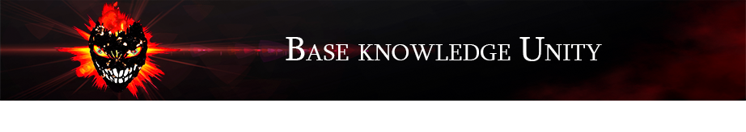

    

        
    
    

        
    

    

        
        
        
    

# Базовые знания Unity 👌
 - В папке **Assets/Scripts** находятся ключевы скрипты

1. 💥 Переменные и основные функции скрипта помещённого на объект
2. 💥 Объекты, компоненты, условные операции и циклы
3. 💥 Отслеживание нажатий от пользователя
4. 💥 Instantiate (Создание объектов)
5. 💥 Инициализация корутин (Coroutines)
6. 💥 События OnCollision и OnTrigger
7. 💥 GameObject.Find

[Видео](https://www.youtube.com/watch?v=wiBYx7n6ey4&list=PL0lO_mIqDDFVNOKquWCHh4n-Ird5HRB_1) - мотивирующее на создание подобного проекта

    

